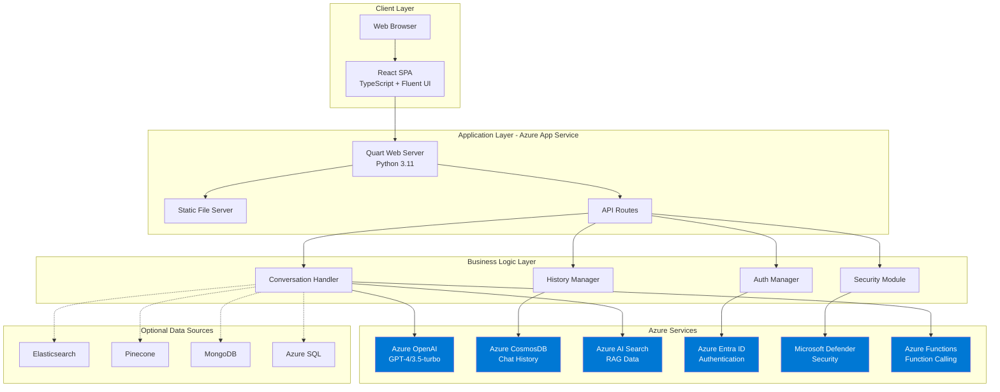
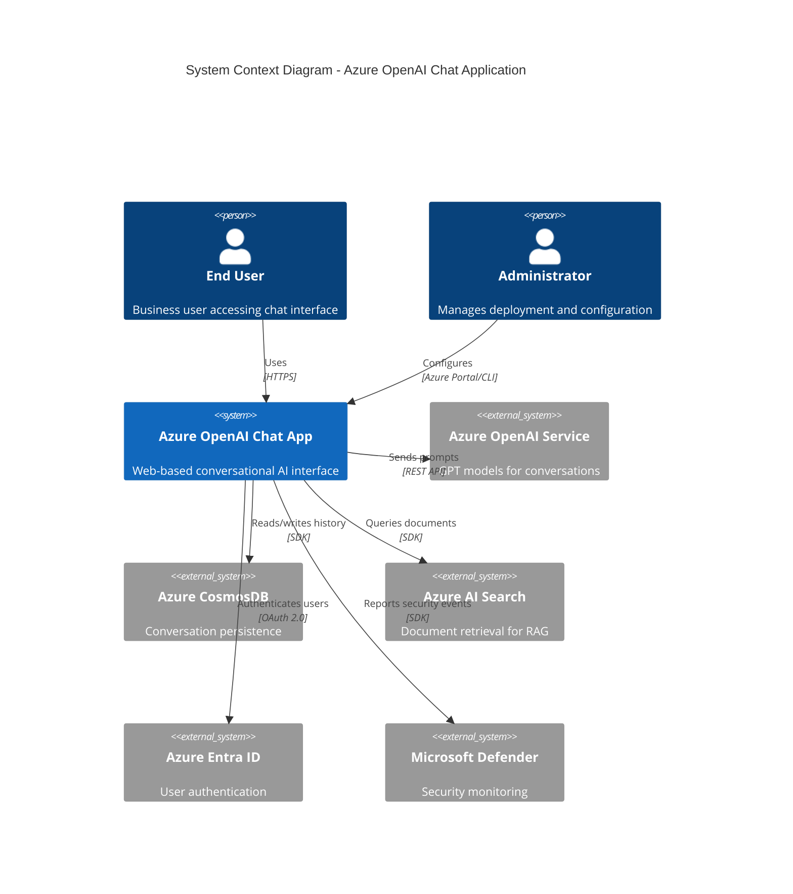
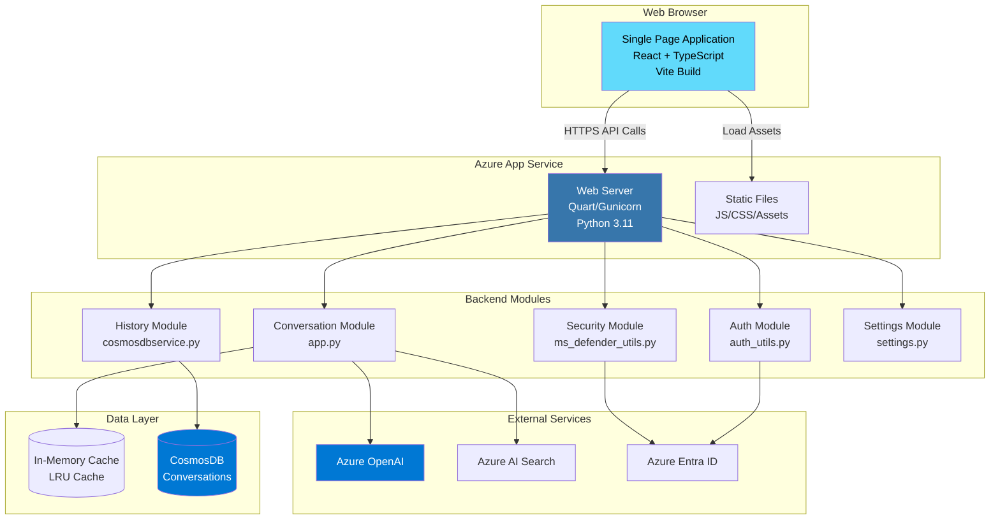
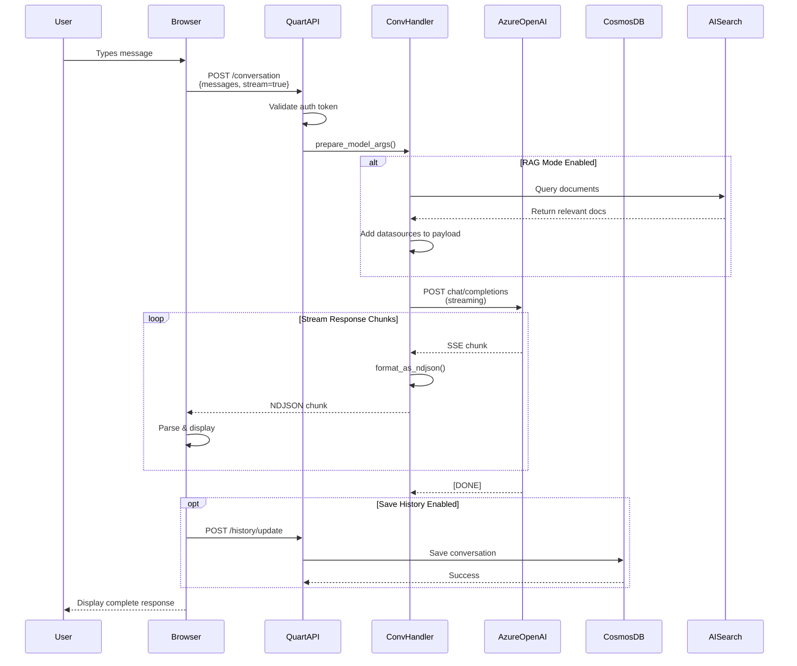
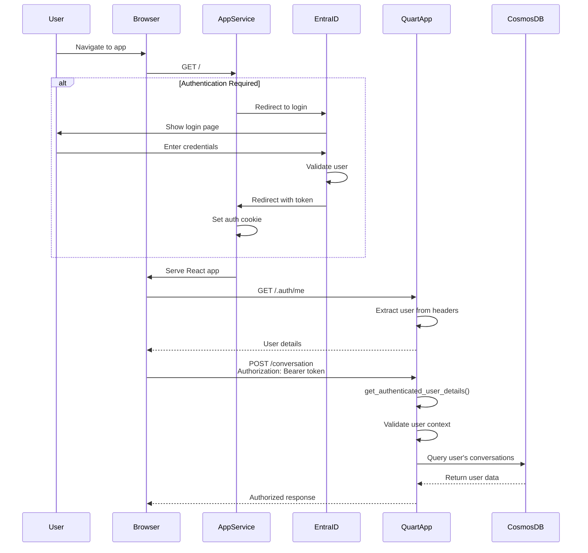
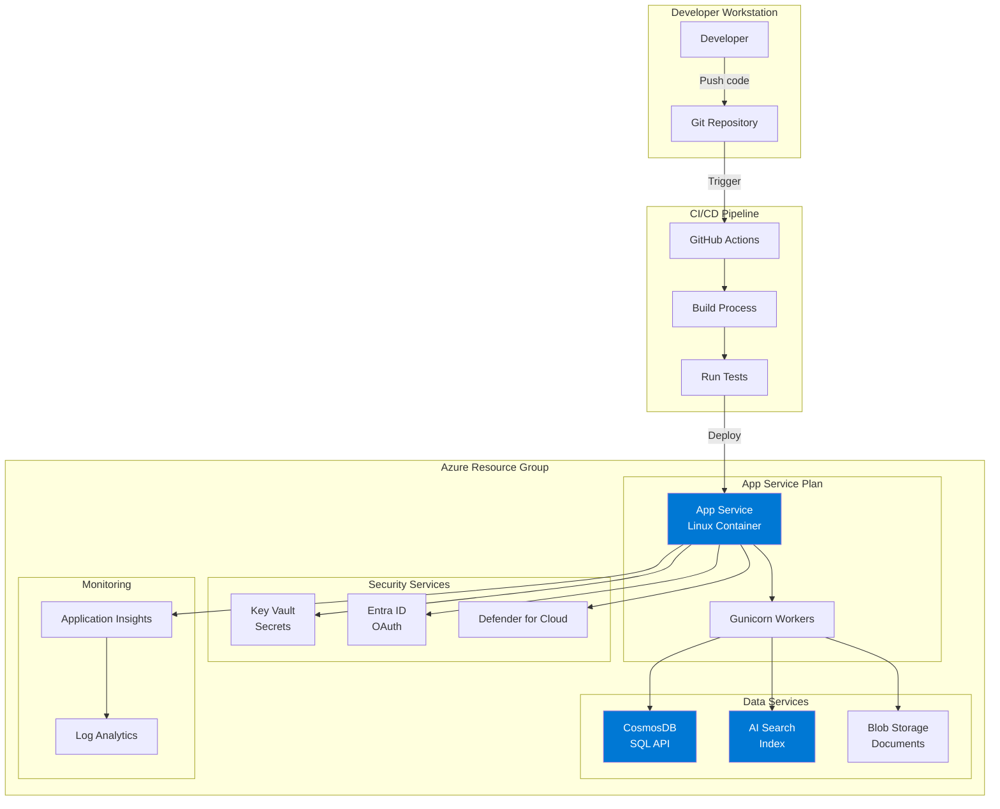
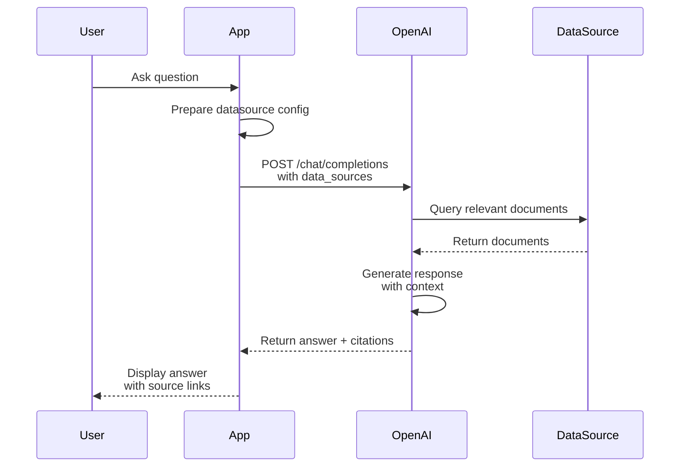
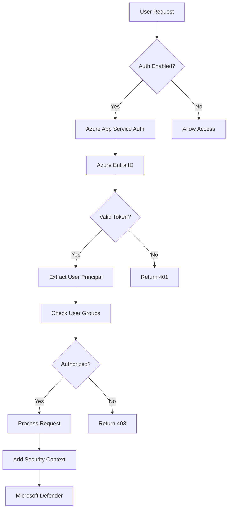
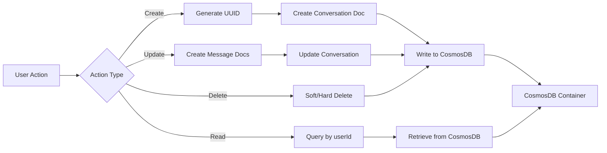

# Azure OpenAI Chat Application - Architecture Documentation

## Table of Contents
1. [Executive Summary](#executive-summary)
2. [System Overview](#system-overview)
3. [Architecture Diagrams](#architecture-diagrams)
4. [Technology Stack](#technology-stack)
5. [Application Structure](#application-structure)
6. [Core Processes and Workflows](#core-processes-and-workflows)
7. [Security Architecture](#security-architecture)
8. [Data Management](#data-management)
9. [API Documentation](#api-documentation)
10. [Deployment Architecture](#deployment-architecture)
11. [Configuration Management](#configuration-management)
12. [Testing Strategy](#testing-strategy)

---

## Executive Summary

This is a **production-ready, enterprise-grade chat application** built on Azure OpenAI services. The application provides an intelligent conversational interface with support for:

- **Real-time Chat**: Conversations powered by GPT-3.5-turbo, GPT-4, and other Azure OpenAI models
- **Retrieval-Augmented Generation (RAG)**: Chat with your own data using multiple datasource integrations
- **Persistent Chat History**: User conversation tracking via Azure CosmosDB
- **Function Calling**: Integration with Azure Functions for extended capabilities
- **Multi-Datasource Support**: Azure AI Search, CosmosDB, Elasticsearch, Pinecone, MongoDB, and more
- **Enterprise Security**: Azure Entra ID authentication, Microsoft Defender integration
- **Scalable Architecture**: Async processing, streaming responses, containerization

**Key Metrics**:
- **Backend**: 1,062 lines of Python (app.py), modular architecture
- **Frontend**: React/TypeScript SPA with 500+ line main chat component
- **Supported Models**: GPT-3.5-turbo, GPT-4, GPT-4-turbo, GPT-4o
- **Deployment Options**: Azure App Service, Docker, Local Development

---

## System Overview

### High-Level Architecture



### Component Overview

| Component | Technology | Purpose | Lines of Code |
|-----------|-----------|---------|---------------|
| **Frontend** | React 18.2 + TypeScript | User interface and interaction | ~3,000+ |
| **Backend API** | Quart (Async Python) | HTTP server and routing | 1,062 (app.py) |
| **Business Logic** | Python modules | Chat, history, auth, security | ~2,000+ |
| **Infrastructure** | Bicep templates | Azure resource provisioning | ~1,500+ |
| **Tests** | Pytest | Unit and integration tests | ~500+ |

---

## Architecture Diagrams

### 1. System Context Diagram



### 2. Container Diagram



### 3. Conversation Flow Sequence Diagram



### 4. Data Flow Diagram

```mermaid
graph LR
    subgraph "Input Layer"
        A[User Message]
        B[Chat History]
        C[System Prompt]
    end

    subgraph "Processing Layer"
        D[Message Formatter]
        E[Context Builder]
        F[Prompt Constructor]
    end

    subgraph "RAG Pipeline (Optional)"
        G[Query Embeddings]
        H[Vector Search]
        I[Document Retrieval]
        J[Context Injection]
    end

    subgraph "AI Layer"
        K[Azure OpenAI API]
        L[Token Management]
        M[Response Streaming]
    end

    subgraph "Output Layer"
        N[Response Parser]
        O[Citation Extractor]
        P[Markdown Renderer]
        Q[Display to User]
    end

    A --> D
    B --> E
    C --> F
    D --> E
    E --> F

    F --> G
    G --> H
    H --> I
    I --> J

    F --> K
    J --> K
    K --> L
    L --> M
    M --> N
    N --> O
    O --> P
    P --> Q

    style K fill:#0078d4,color:#fff
```



### 5. Authentication Flow



### 6. Deployment Architecture



---

## Technology Stack

### Backend Technologies

| Category | Technology | Version | Purpose |
|----------|-----------|---------|---------|
| **Runtime** | Python | 3.11 | Core language |
| **Web Framework** | Quart | 0.19.9 | Async web server (Flask alternative) |
| **WSGI Server** | Gunicorn | 20.1.0 | Production server |
| **AI SDK** | OpenAI | 1.55.3 | Azure OpenAI client |
| **Data Validation** | Pydantic | 2.2.1 | Settings and request validation |
| **HTTP Client** | httpx | 3.9.2 | Async HTTP requests |
| **Azure SDK** | azure-identity | 1.15.0 | Authentication |
| | azure-search-documents | 11.4.0b6 | AI Search |
| | azure-cosmos | 4.5.0 | CosmosDB client |
| | azure-storage-blob | 12.17.0 | Blob storage |
| **Utilities** | python-dotenv | 1.0.0 | Environment config |
| | tenacity | 8.2.3 | Retry logic |
| | aiohttp | 3.9.2 | Async HTTP |

### Frontend Technologies

| Category | Technology | Version | Purpose |
|----------|-----------|---------|---------|
| **Framework** | React | 18.2.0 | UI library |
| **Language** | TypeScript | 4.9.5 | Static typing |
| **Build Tool** | Vite | 4.1.5 | Dev server and bundler |
| **UI Library** | Fluent UI React | 8.109.0 | Microsoft design system |
| **Icons** | Fluent UI Icons | 2.0.195 | Icon components |
| **Routing** | React Router | 6.8.1 | Client-side routing |
| **Markdown** | React Markdown | 8.0.5 | Render chat responses |
| **Security** | DOMPurify | 3.0.8 | HTML sanitization |
| **Syntax Highlighting** | React Syntax Highlighter | 15.5.0 | Code blocks |
| **HTTP Client** | Fetch API | Native | API communication |

### Infrastructure Technologies

| Category | Technology | Purpose |
|----------|-----------|---------|
| **IaC** | Bicep | Azure resource templates |
| **CLI** | Azure Developer CLI (azd) | Deployment automation |
| **Containers** | Docker | Containerization |
| **CI/CD** | GitHub Actions | Automated workflows |
| **Monitoring** | Application Insights | Telemetry and logging |

---

## Application Structure

### Directory Structure

```
sample-app-aoai-chatGPT/
│
├── app.py                          # Main application entry point (1,062 lines)
├── requirements.txt                # Python dependencies
├── gunicorn.conf.py               # Production server configuration
├── azure.yaml                     # Azure Developer CLI config
├── .env.sample                    # Environment variable template
│
├── backend/                       # Backend business logic
│   ├── auth/
│   │   ├── auth_utils.py         # Authentication helpers
│   │   └── sample_user.py        # Sample user creation
│   ├── history/
│   │   └── cosmosdbservice.py    # CosmosDB conversation service
│   ├── security/
│   │   └── ms_defender_utils.py  # Microsoft Defender integration
│   ├── settings.py               # Configuration management (Pydantic)
│   └── utils.py                  # Utility functions
│
├── frontend/                      # React application
│   ├── src/
│   │   ├── pages/
│   │   │   ├── chat/Chat.tsx     # Main chat interface (500+ lines)
│   │   │   ├── layout/Layout.tsx # App layout wrapper
│   │   │   └── NoPage.tsx        # 404 page
│   │   ├── components/
│   │   │   ├── Answer/           # Answer display components
│   │   │   ├── QuestionInput/    # User input components
│   │   │   ├── ChatHistory/      # History panel components
│   │   │   ├── Example/          # Example questions
│   │   │   └── common/           # Shared components
│   │   ├── api/
│   │   │   ├── api.ts            # API client functions
│   │   │   └── models.ts         # TypeScript interfaces
│   │   ├── state/
│   │   │   ├── AppProvider.tsx   # React context provider
│   │   │   └── AppReducer.tsx    # State management
│   │   └── index.tsx             # Application entry point
│   ├── vite.config.ts            # Vite build configuration
│   └── package.json              # Node.js dependencies
│
├── static/                        # Built frontend assets (generated by Vite)
│   └── assets/                   # JS, CSS, images
│
├── infra/                         # Infrastructure as Code (Bicep)
│   ├── main.bicep               # Main infrastructure template
│   ├── core/                    # Core resource modules
│   └── db.bicep                 # Database configuration
│
├── tests/                         # Test suite
│   ├── unit_tests/              # Unit tests
│   └── integration_tests/       # Integration tests
│
├── scripts/                       # Deployment scripts
│   ├── auth_init.sh             # Authentication setup
│   └── prepdocs.sh              # Document preparation
│
└── .github/
    └── workflows/               # GitHub Actions CI/CD
```

### Module Breakdown

#### Backend Modules

**app.py** (1,062 lines)
- Quart application initialization
- Route handlers for conversation, history, settings
- Conversation orchestration
- Streaming response handling
- Function calling support
- Error handling and logging

**backend/settings.py**
- Pydantic settings management
- Environment variable loading
- Configuration validation
- Type-safe settings classes for:
  - Azure OpenAI
  - Chat history (CosmosDB)
  - Data sources (Search, Elasticsearch, etc.)
  - UI customization
  - Security options

**backend/utils.py**
- Response formatting (NDJSON, JSON)
- Stream processing
- Message filtering
- User group fetching
- Utility decorators

**backend/history/cosmosdbservice.py**
- CosmosDB client wrapper
- Conversation CRUD operations
- Message persistence
- User-based conversation retrieval
- Conversation metadata management

**backend/auth/auth_utils.py**
- User authentication extraction
- Token validation
- User context building
- Admin role checking

**backend/security/ms_defender_utils.py**
- Microsoft Defender integration
- Security context JSON construction
- User security metadata

#### Frontend Modules

**Chat.tsx** (500+ lines)
- Main chat interface
- Message display
- User input handling
- Citation rendering
- History panel integration
- Real-time streaming display
- Error handling

**api.ts**
- API client functions:
  - `conversationApi()` - Send chat messages
  - `historyGenerate()` - Create conversation
  - `historyUpdate()` - Save messages
  - `historyList()` - Get conversations
  - `historyRead()` - Get messages
  - `historyDelete()` - Delete conversation
  - `getSettingsApi()` - Fetch settings

**AppProvider.tsx & AppReducer.tsx**
- Global state management
- Actions:
  - `UPDATE_CURRENT_CHAT`
  - `UPDATE_CHAT_HISTORY`
  - `UPDATE_CHAT_HISTORY_LOADING_STATE`
  - `FETCH_FRONTEND_SETTINGS`
  - `SET_COSMOSDB_STATUS`

**AnswerParser.tsx**
- Markdown parsing
- Citation extraction
- Code syntax highlighting
- Link rendering
- Table formatting

---

## Core Processes and Workflows

### 1. Chat Conversation Process

**Endpoint**: `POST /conversation`

**Request Flow**:

```
1. Frontend (Chat.tsx)
   └─ User types message
   └─ Click send button
   └─ Call conversationApi()

2. API Layer (app.py:585)
   └─ @bp.route("/conversation", methods=["POST"])
   └─ Extract user from auth headers
   └─ Validate Azure OpenAI configuration
   └─ Parse ConversationRequest

3. Model Preparation (app.py:prepare_model_args)
   └─ Construct messages array
   └─ Add system message
   └─ Add chat history
   └─ Configure data sources (if enabled)
   └─ Set temperature, max_tokens, etc.
   └─ Add user security context (Defender)

4. Azure OpenAI Call (app.py:send_chat_request)
   └─ Choose streaming vs non-streaming

   ┌─ Stream Mode (app.py:stream_chat_request)
   │  └─ async for chunk in response
   │  └─ format_as_ndjson()
   │  └─ yield NDJSON lines
   │
   └─ Non-Stream Mode (app.py:complete_chat_request)
      └─ Await full response
      └─ format_non_streaming_response()
      └─ Return JSON

5. Response Processing
   └─ Frontend receives NDJSON chunks
   └─ Parse each chunk
   └─ Update UI progressively
   └─ Extract citations
   └─ Render markdown

6. History Persistence (Optional)
   └─ User clicks save
   └─ POST /history/update
   └─ Save to CosmosDB
```

**Key Functions**:

```python
# app.py

async def conversation():
    """Main conversation endpoint"""
    # 1. Validate request
    # 2. Prepare model args
    # 3. Send to Azure OpenAI
    # 4. Stream or return response

def prepare_model_args(request, user_json):
    """Construct Azure OpenAI request payload"""
    # Add system message
    # Add chat history
    # Configure data sources
    # Set model parameters

async def send_chat_request(request, model_args):
    """Send request to Azure OpenAI"""
    # Choose stream vs non-stream
    # Handle function calls
    # Return formatted response
```

### 2. Chat History Management Process

**Endpoints**:
- `POST /history/generate` - Create new conversation
- `POST /history/update` - Add messages
- `GET /history/list` - List conversations
- `POST /history/read` - Get messages
- `POST /history/rename` - Rename conversation
- `DELETE /history/delete` - Delete conversation

**CosmosDB Schema**:

```json
{
  "id": "conversation-uuid",
  "type": "conversation",
  "userId": "user@example.com",
  "createdAt": "2025-12-07T10:00:00Z",
  "updatedAt": "2025-12-07T10:05:00Z",
  "title": "Conversation about Azure",
  "date": "2025-12-07T10:00:00Z"
}

{
  "id": "message-uuid",
  "type": "message",
  "userId": "user@example.com",
  "createdAt": "2025-12-07T10:00:00Z",
  "updatedAt": "2025-12-07T10:00:00Z",
  "conversationId": "conversation-uuid",
  "role": "user",
  "content": "What is Azure OpenAI?",
  "feedback": null
}
```

**Workflow**:

```
1. Create Conversation
   POST /history/generate
   └─ Generate UUID
   └─ Create conversation document
   └─ Return conversation ID

2. User Sends Message
   └─ Message stored in React state

3. Receive AI Response
   └─ Response stored in React state

4. Save to History
   POST /history/update
   └─ Create user message document
   └─ Create assistant message document
   └─ Update conversation updatedAt

5. Load History
   GET /history/list
   └─ Query conversations by userId
   └─ Order by updatedAt DESC
   └─ Return conversation list

6. View Conversation
   POST /history/read
   └─ Query messages by conversationId
   └─ Order by createdAt ASC
   └─ Return messages array
```

### 3. RAG (Retrieval-Augmented Generation) Process

**Supported Data Sources**:
1. Azure AI Search
2. Azure CosmosDB Mongo vCore
3. Elasticsearch
4. Pinecone
5. MongoDB
6. Azure ML Index
7. Azure SQL Server
8. Prompt Flow

**RAG Flow**:



**Configuration Example** (Azure AI Search):

```python
# backend/settings.py

class _AzureSearchSettings:
    endpoint: str
    key: str
    index_name: str
    semantic_config: str
    top_n_documents: int = 5
    query_type: str = "vector_semantic_hybrid"

    def construct_payload_configuration(self):
        return {
            "type": "azure_search",
            "parameters": {
                "endpoint": self.endpoint,
                "index_name": self.index_name,
                "semantic_configuration": self.semantic_config,
                "query_type": self.query_type,
                "top_n_documents": self.top_n_documents,
                "authentication": {
                    "type": "api_key",
                    "key": self.key
                }
            }
        }
```

### 4. Function Calling Process

**Flow**:

```
1. User Message
   └─ "What's the weather in Seattle?"

2. Azure OpenAI Response
   └─ Response includes tool_calls
   └─ {
       "tool_calls": [{
         "id": "call_123",
         "function": {
           "name": "get_weather",
           "arguments": '{"location": "Seattle"}'
         }
       }]
     }

3. Process Function Call (app.py:process_function_call)
   └─ Extract function name and arguments
   └─ Call openai_remote_azure_function_call()

4. Execute Azure Function
   POST https://<function-app>.azurewebsites.net/api/<function-name>
   └─ Execute function logic
   └─ Return result

5. Add Function Result to Messages
   └─ Append tool result to messages array

6. Send Follow-up Request to OpenAI
   └─ Include original messages + function result
   └─ Get final response

7. Return to User
   └─ Display final answer
```

### 5. Authentication and Authorization Process

**Authentication Methods**:
1. Azure App Service Easy Auth
2. Azure Entra ID (OAuth 2.0)
3. Development mode (no auth)

**Authorization Flow**:

```python
# app.py

@bp.before_request
async def ensure_authenticated():
    """Check authentication before each request"""
    if app_settings.base.auth_enabled:
        user = await get_authenticated_user_details()
        if not user:
            return {"error": "Unauthorized"}, 401

async def get_authenticated_user_details():
    """Extract user from request headers"""
    # Check X-MS-CLIENT-PRINCIPAL header
    # Decode base64 user info
    # Return user object
```

**User Context Usage**:
- Filter conversations by userId
- Document-level access control in search
- Microsoft Defender security context
- Audit logging

### 6. Security Integration Process

**Microsoft Defender for Cloud**:

```python
# backend/security/ms_defender_utils.py

def get_msdefender_user_json(user_json):
    """Build security context for Defender"""
    return {
        "user_id": user_json.get("user_principal_id"),
        "user_name": user_json.get("user_name"),
        "groups": user_json.get("groups", [])
    }
```

**Security Features**:
- HTML sanitization (DOMPurify on frontend)
- Input validation (Pydantic on backend)
- CORS configuration
- Secrets in Azure Key Vault
- Network security groups
- Managed identity authentication

---

## Security Architecture

### Authentication & Authorization



### Security Layers

| Layer | Technology | Protection |
|-------|-----------|------------|
| **Network** | Azure NSG, Private Endpoints | Network isolation |
| **Authentication** | Azure Entra ID | Identity verification |
| **Authorization** | RBAC, Group-based access | Resource access control |
| **Secrets Management** | Azure Key Vault | Secure credential storage |
| **Input Validation** | Pydantic schemas | Prevent injection attacks |
| **Output Sanitization** | DOMPurify | XSS prevention |
| **API Security** | API keys, Managed Identity | Service authentication |
| **Monitoring** | Microsoft Defender, App Insights | Threat detection |
| **Transport** | HTTPS/TLS 1.2+ | Encryption in transit |
| **Data at Rest** | Azure encryption | Data protection |

### Threat Mitigation

**OWASP Top 10 Protection**:

1. **Injection** → Pydantic validation, parameterized queries
2. **Broken Authentication** → Azure Entra ID, OAuth 2.0
3. **Sensitive Data Exposure** → Key Vault, encrypted storage
4. **XML External Entities (XXE)** → JSON-only API
5. **Broken Access Control** → RBAC, user context filtering
6. **Security Misconfiguration** → Bicep templates, secure defaults
7. **XSS** → DOMPurify sanitization
8. **Insecure Deserialization** → JSON schema validation
9. **Known Vulnerabilities** → Dependabot, regular updates
10. **Insufficient Logging** → Application Insights, audit logs

---

## Data Management

### CosmosDB Schema

**Database**: `db_conversation_history`
**Container**: `conversations`
**Partition Key**: `/userId`

**Document Types**:

1. **Conversation Document**
```json
{
  "id": "550e8400-e29b-41d4-a716-446655440000",
  "type": "conversation",
  "userId": "user@contoso.com",
  "createdAt": "2025-12-07T10:00:00Z",
  "updatedAt": "2025-12-07T10:30:00Z",
  "title": "Azure OpenAI Discussion",
  "date": "2025-12-07T10:00:00Z"
}
```

2. **Message Document**
```json
{
  "id": "660e8400-e29b-41d4-a716-446655440001",
  "type": "message",
  "userId": "user@contoso.com",
  "createdAt": "2025-12-07T10:00:15Z",
  "updatedAt": "2025-12-07T10:00:15Z",
  "conversationId": "550e8400-e29b-41d4-a716-446655440000",
  "role": "user",
  "content": "What is Azure OpenAI?",
  "feedback": null
}
```

### Data Flow



### Caching Strategy

**LRU Cache** (app.py):
```python
@lru_cache(maxsize=1)
def get_user_groups(user_principal_id: str):
    """Cache user groups for performance"""
    # Fetch from Microsoft Graph API
    # Cache for session duration
```

**Cache Invalidation**:
- User logout
- Token expiration
- Manual clear

---

## API Documentation

### Conversation Endpoints

#### POST /conversation
**Description**: Send a chat message and receive AI response

**Request Body**:
```json
{
  "messages": [
    {
      "role": "user",
      "content": "What is Azure OpenAI?"
    }
  ],
  "stream": true,
  "conversation_id": "uuid-optional",
  "context": {
    "temperature": 0.7,
    "max_tokens": 1000,
    "top_p": 1.0
  }
}
```

**Response** (Streaming - NDJSON):
```
{"choices":[{"delta":{"role":"assistant"},"index":0}]}
{"choices":[{"delta":{"content":"Azure"},"index":0}]}
{"choices":[{"delta":{"content":" OpenAI"},"index":0}]}
...
{"choices":[{"finish_reason":"stop","index":0}]}
{"apim-request-id":"abc123"}
[DONE]
```

**Response** (Non-streaming - JSON):
```json
{
  "id": "chatcmpl-abc123",
  "model": "gpt-4",
  "choices": [
    {
      "message": {
        "role": "assistant",
        "content": "Azure OpenAI is a cloud service..."
      },
      "finish_reason": "stop"
    }
  ],
  "usage": {
    "prompt_tokens": 10,
    "completion_tokens": 50,
    "total_tokens": 60
  }
}
```

### History Endpoints

#### POST /history/generate
**Description**: Create a new conversation

**Request Body**:
```json
{
  "messages": [
    {"role": "user", "content": "Hello"}
  ]
}
```

**Response**:
```json
{
  "conversation_id": "550e8400-e29b-41d4-a716-446655440000",
  "title": "New Conversation",
  "date": "2025-12-07T10:00:00Z"
}
```

#### POST /history/update
**Description**: Add messages to existing conversation

**Request Body**:
```json
{
  "conversation_id": "550e8400-e29b-41d4-a716-446655440000",
  "messages": [
    {"role": "user", "content": "Follow-up question"},
    {"role": "assistant", "content": "Answer to follow-up"}
  ]
}
```

**Response**:
```json
{
  "success": true
}
```

#### GET /history/list
**Description**: Get all conversations for authenticated user

**Query Parameters**:
- `offset`: Number (default: 0)
- `limit`: Number (default: 25)

**Response**:
```json
{
  "conversations": [
    {
      "id": "550e8400-e29b-41d4-a716-446655440000",
      "title": "Azure OpenAI Discussion",
      "date": "2025-12-07T10:00:00Z",
      "updatedAt": "2025-12-07T10:30:00Z"
    }
  ]
}
```

#### POST /history/read
**Description**: Get messages in a conversation

**Request Body**:
```json
{
  "conversation_id": "550e8400-e29b-41d4-a716-446655440000"
}
```

**Response**:
```json
{
  "conversation_id": "550e8400-e29b-41d4-a716-446655440000",
  "messages": [
    {
      "id": "msg-1",
      "role": "user",
      "content": "What is Azure?",
      "createdAt": "2025-12-07T10:00:00Z"
    },
    {
      "id": "msg-2",
      "role": "assistant",
      "content": "Azure is Microsoft's cloud platform...",
      "createdAt": "2025-12-07T10:00:05Z"
    }
  ]
}
```

#### POST /history/rename
**Description**: Rename a conversation

**Request Body**:
```json
{
  "conversation_id": "550e8400-e29b-41d4-a716-446655440000",
  "title": "New Title"
}
```

#### DELETE /history/delete
**Description**: Delete a conversation

**Request Body**:
```json
{
  "conversation_id": "550e8400-e29b-41d4-a716-446655440000"
}
```

#### DELETE /history/delete_all
**Description**: Delete all conversations for user

**Response**:
```json
{
  "message": "All conversations deleted successfully"
}
```

### Settings Endpoints

#### GET /frontend_settings
**Description**: Get UI configuration

**Response**:
```json
{
  "auth_enabled": true,
  "feedback_enabled": true,
  "ui": {
    "title": "Azure OpenAI Chat",
    "chat_logo": "/assets/logo.svg",
    "chat_title": "Start chatting",
    "chat_description": "This chatbot is configured to answer your questions"
  },
  "sanitize_answer": true
}
```

---

## Deployment Architecture

### Azure Resources

**Resource Group**: `rg-{env}-{app-name}`

| Resource | Type | Purpose | SKU |
|----------|------|---------|-----|
| **App Service Plan** | Microsoft.Web/serverfarms | Hosting infrastructure | B1 (Dev), P1V2 (Prod) |
| **App Service** | Microsoft.Web/sites | Web application | Linux |
| **Azure OpenAI** | Microsoft.CognitiveServices | AI models | S0 |
| **CosmosDB Account** | Microsoft.DocumentDB | Chat history | Standard |
| **AI Search** | Microsoft.Search | Document search | Basic/Standard |
| **Key Vault** | Microsoft.KeyVault | Secrets management | Standard |
| **Application Insights** | Microsoft.Insights | Monitoring | - |
| **Log Analytics** | Microsoft.OperationalInsights | Logs | Pay-as-you-go |
| **Storage Account** | Microsoft.Storage | Blob storage | Standard LRS |

### Deployment Options

#### Option 1: Azure Developer CLI (Recommended)

```bash
# Install Azure Developer CLI
curl -fsSL https://aka.ms/install-azd.sh | bash

# Login to Azure
azd auth login

# Provision and deploy
azd up
```

**Process**:
1. Provision Azure resources (Bicep templates)
2. Configure authentication
3. Build frontend (Vite)
4. Install Python dependencies
5. Deploy to App Service
6. Run post-provisioning scripts

#### Option 2: Manual Deployment

```bash
# Build frontend
cd frontend
npm install
npm run build

# Install backend dependencies
cd ..
pip install -r requirements.txt

# Run locally
python -m quart run --port 50505

# Deploy to Azure
az webapp up --name <app-name> --resource-group <rg-name>
```

#### Option 3: Docker Deployment

```bash
# Build image
docker build -t azure-openai-chat -f WebApp.Dockerfile .

# Run container
docker run -p 8080:8080 \
  -e AZURE_OPENAI_ENDPOINT=<endpoint> \
  -e AZURE_OPENAI_KEY=<key> \
  azure-openai-chat
```

#### Option 4: GitHub Actions CI/CD

```yaml
# .github/workflows/deploy.yml
name: Deploy to Azure

on:
  push:
    branches: [main]

jobs:
  build-and-deploy:
    runs-on: ubuntu-latest
    steps:
      - uses: actions/checkout@v3
      - name: Build frontend
        run: |
          cd frontend
          npm install
          npm run build
      - name: Deploy to Azure
        uses: azure/webapps-deploy@v2
        with:
          app-name: ${{ secrets.AZURE_WEBAPP_NAME }}
          publish-profile: ${{ secrets.AZURE_WEBAPP_PUBLISH_PROFILE }}
```

### Environment Configuration

**Required Environment Variables**:

```bash
# Azure OpenAI
AZURE_OPENAI_ENDPOINT=https://<resource>.openai.azure.com/
AZURE_OPENAI_API_KEY=<key>
AZURE_OPENAI_MODEL=gpt-4
AZURE_OPENAI_API_VERSION=2024-02-15-preview
AZURE_OPENAI_STREAM=true
AZURE_OPENAI_TEMPERATURE=0.7
AZURE_OPENAI_MAX_TOKENS=1000

# Chat History
AZURE_COSMOSDB_ACCOUNT=<cosmos-account-name>
AZURE_COSMOSDB_DATABASE=db_conversation_history
AZURE_COSMOSDB_CONVERSATIONS_CONTAINER=conversations
AZURE_COSMOSDB_ENABLE_FEEDBACK=true

# Authentication
AUTH_ENABLED=true

# Data Source (Optional)
DATASOURCE_TYPE=AzureAISearch
AZURE_SEARCH_SERVICE=<search-service-name>
AZURE_SEARCH_INDEX=<index-name>
AZURE_SEARCH_KEY=<key>
AZURE_SEARCH_SEMANTIC_CONFIG=<config-name>

# UI Customization
UI_TITLE=Azure OpenAI Chat
UI_CHAT_LOGO=/assets/logo.svg
UI_CHAT_TITLE=Start chatting
UI_CHAT_DESCRIPTION=Ask me anything about your data

# Security
SANITIZE_ANSWER=true
MS_DEFENDER_ENABLED=false
```

---

## Configuration Management

### Settings Architecture

**Backend** (backend/settings.py):

```python
from pydantic import BaseSettings, Field
from functools import lru_cache

class _BaseSettings(BaseSettings):
    auth_enabled: bool = Field(default=False)
    sanitize_answer: bool = Field(default=True)

class _AzureOpenAISettings(BaseSettings):
    endpoint: str = Field(...)
    key: str = Field(...)
    model: str = Field(default="gpt-4")
    api_version: str = Field(default="2024-02-15-preview")
    stream: bool = Field(default=True)
    temperature: float = Field(default=0.7, ge=0.0, le=2.0)
    max_tokens: int = Field(default=1000, ge=1)
    top_p: float = Field(default=1.0, ge=0.0, le=1.0)

class _ChatHistorySettings(BaseSettings):
    enabled: bool = Field(default=False)
    cosmosdb_endpoint: str = Field(default="")
    cosmosdb_key: str = Field(default="")
    cosmosdb_database: str = Field(default="db_conversation_history")

@lru_cache()
def get_settings():
    """Cached settings instance"""
    return AppSettings()
```

**Frontend** (served via `/frontend_settings`):

```typescript
// frontend/src/api/models.ts

export interface FrontendSettings {
  auth_enabled: boolean;
  feedback_enabled: boolean;
  ui: {
    title: string;
    chat_logo: string;
    chat_title: string;
    chat_description: string;
    show_share_button: boolean;
  };
  sanitize_answer: boolean;
}
```

### Configuration Validation

**Pydantic Validators**:

```python
class _AzureOpenAISettings(BaseSettings):
    temperature: float = Field(default=0.7, ge=0.0, le=2.0)

    @validator('temperature')
    def validate_temperature(cls, v):
        if not 0.0 <= v <= 2.0:
            raise ValueError('Temperature must be between 0.0 and 2.0')
        return v
```

**TypeScript Interfaces**:

```typescript
export interface ConversationRequest {
  messages: ChatMessage[];
  stream?: boolean;
  context?: {
    temperature?: number;
    max_tokens?: number;
    top_p?: number;
  };
}
```

---

## Testing Strategy

### Test Structure

```
tests/
├── conftest.py                    # Pytest configuration
├── unit_tests/
│   ├── test_utils.py              # Utility function tests
│   ├── test_settings.py           # Configuration tests
│   └── dotenv_data/               # Test env files
└── integration_tests/
    ├── test_datasources.py        # Data source integration
    ├── conftest.py                # Integration test fixtures
    └── dotenv_templates/          # Integration env templates
```

### Unit Tests

**Example** (tests/unit_tests/test_utils.py):

```python
import pytest
from backend.utils import format_as_ndjson, format_non_streaming_response

def test_format_as_ndjson():
    obj = {"test": "value"}
    result = format_as_ndjson(obj)
    assert result == '{"test": "value"}\n'

def test_format_non_streaming_response():
    response_obj = {
        "id": "test-id",
        "choices": [{"message": {"content": "Test"}}]
    }
    result = format_non_streaming_response(response_obj)
    assert "id" in result
    assert "choices" in result
```

### Integration Tests

**Example** (tests/integration_tests/test_datasources.py):

```python
import pytest
from app import app

@pytest.mark.asyncio
async def test_azure_search_conversation():
    async with app.test_client() as client:
        response = await client.post('/conversation', json={
            "messages": [
                {"role": "user", "content": "Test question"}
            ]
        })
        assert response.status_code == 200
```

### Frontend Tests

**Jest Configuration** (frontend/jest.config.ts):

```typescript
export default {
  preset: 'ts-jest',
  testEnvironment: 'jsdom',
  setupFilesAfterEnv: ['<rootDir>/src/setupTests.ts'],
  moduleNameMapper: {
    '\\.(css|less|scss)$': 'identity-obj-proxy',
  },
};
```

**Component Tests** (frontend/src/__tests__/Chat.test.tsx):

```typescript
import { render, screen } from '@testing-library/react';
import { Chat } from '../pages/chat/Chat';

test('renders chat interface', () => {
  render(<Chat />);
  expect(screen.getByPlaceholderText(/Type a message/i)).toBeInTheDocument();
});
```

### Test Execution

```bash
# Backend unit tests
pytest tests/unit_tests/

# Backend integration tests
pytest tests/integration_tests/

# Frontend tests
cd frontend
npm test

# Coverage report
pytest --cov=backend --cov-report=html
```

---

## Performance Optimization

### Backend Optimizations

1. **Async/Await**: All I/O operations use async
2. **Streaming Responses**: NDJSON streaming for lower latency
3. **Connection Pooling**: Reuse HTTP connections
4. **Caching**: LRU cache for user groups
5. **Gunicorn Workers**: Multi-process scaling

**Gunicorn Configuration** (gunicorn.conf.py):

```python
import multiprocessing

max_requests = 1000
max_requests_jitter = 50
log_file = "-"
bind = "0.0.0.0:8080"
worker_class = "uvicorn.workers.UvicornWorker"
workers = (multiprocessing.cpu_count() * 2) + 1
timeout = 120
```

### Frontend Optimizations

1. **Code Splitting**: Vite automatic chunking
2. **Tree Shaking**: Remove unused code
3. **Lazy Loading**: Load components on demand
4. **Memoization**: React.memo for components
5. **Virtual Scrolling**: For long chat histories

**Vite Configuration** (frontend/vite.config.ts):

```typescript
export default defineConfig({
  build: {
    outDir: '../static',
    emptyOutDir: true,
    sourcemap: false,
    rollupOptions: {
      output: {
        manualChunks: {
          vendor: ['react', 'react-dom'],
          ui: ['@fluentui/react']
        }
      }
    }
  }
});
```

### Database Optimizations

1. **Partition Key**: `/userId` for query efficiency
2. **Indexing**: Automatic CosmosDB indexing
3. **Pagination**: Limit + offset for large result sets
4. **TTL**: Optional time-to-live for old conversations

---

## Monitoring and Observability

### Application Insights Integration

**Metrics Tracked**:
- Request count and duration
- Dependency calls (Azure OpenAI, CosmosDB)
- Exception rates
- Custom events (conversation created, message sent)

**Custom Telemetry** (app.py):

```python
from applicationinsights import TelemetryClient

tc = TelemetryClient(os.getenv('APPINSIGHTS_INSTRUMENTATIONKEY'))

# Track custom event
tc.track_event('conversation_started', {
    'user_id': user['user_principal_id'],
    'model': app_settings.azure_openai.model
})

# Track custom metric
tc.track_metric('conversation_length', len(messages))
```

### Log Analytics Queries

```kusto
// Average response time
requests
| where timestamp > ago(1h)
| summarize avg(duration) by bin(timestamp, 5m)

// Error rate
exceptions
| where timestamp > ago(1h)
| summarize count() by type
| order by count_ desc

// Most active users
customEvents
| where name == "conversation_started"
| summarize conversations = count() by user_id
| order by conversations desc
```

---

## Conclusion

This Azure OpenAI Chat Application represents a **production-ready, enterprise-grade solution** for building intelligent conversational interfaces. The architecture demonstrates:

✅ **Scalability**: Async processing, streaming, multi-worker support
✅ **Security**: Multi-layer security with Entra ID, Defender, Key Vault
✅ **Flexibility**: Multi-datasource RAG support, configurable models
✅ **Maintainability**: Clean separation of concerns, type-safe configuration
✅ **Observability**: Comprehensive monitoring and logging
✅ **Deployment**: Multiple deployment options with IaC templates

The codebase is well-structured for extension and customization to meet specific business requirements.

---

**Document Version**: 1.0
**Last Updated**: December 7, 2025
**Author**: Architecture Documentation Team
