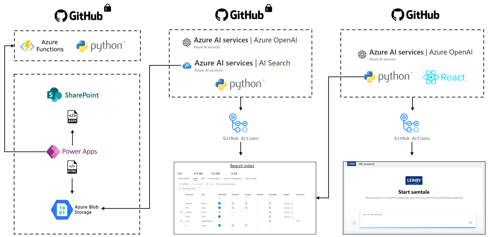
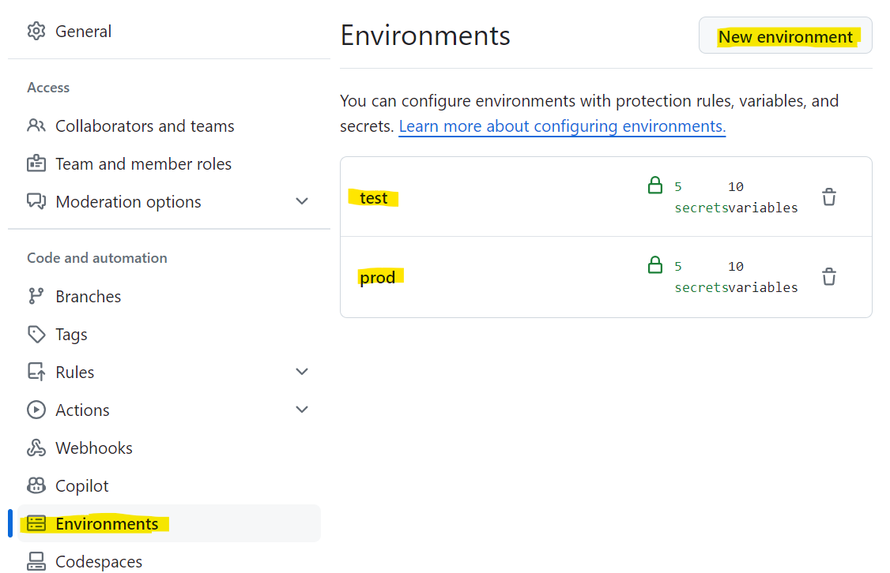

# Lerøy HR assistant

Welcome to the Lerøy HR Assistant repository! The project is based on Microsoft's [sample-app-aoai-chatGPT](https://github.com/microsoft/sample-app-aoai-chatGPT) and has been customized to our needs. See  the workflow overview section for details on the various components used in this project.

Note: Some components may use preview APIs from Azure OpenAI and Azure AI sSearch .


## Workflow overview



## 1. Data acquisition and processing

- **Data extraction:** Utilize Power Automate to extract .aspx files from SharePoint pages.
- **Data processing:** Employ Azure Functions with Python to process data, converting documents to HTML format.
- **Data storage:** Store processed data in Azure Blob Storage.

## 2. Azure AI Search index creation

- **Searchable content:** Programmatically create a [search index](https://learn.microsoft.com/en-us/azure/search/search-what-is-an-index) using Azure AI Search. Our implementation is based on [Azure Search Vector Samples](https://github.com/Azure/azure-search-vector-samples/blob/main/demo-python/code/integrated-vectorization/azure-search-integrated-vectorization-sample.ipynb).
- **Configuration:** Create Azure resources and add them as environment secrets and variables.
- **Deployment:** Create and update indexes using GitHub Actions.

## 3. Chat Application

- **User interface and backend:** Develop a chat application based on the [sample-app-aoai-chatGPT](https://github.com/microsoft/sample-app-aoai-chatGPT) repository.
- **Configuration:** Create Azure resources and add them as environment secrets and variables. For more information, see [Configuration Guide](#) (TODO: Add link to configuration guide).
- **Deployment:** Create and update the application using GitHub Actions.

## HR assistant system message template

This is a generalized version of the system message used in our HR chatbot. Customize it to fit your specific needs and company policies. 

```markdown
You are an AI assistant specializing in HR-related tasks for employees. Adhere to these guidelines:

## Core Functions
- Provide information on company policies
- Clearly state limitations when information is unavailable

## Language and Communication
- Use professional yet friendly language in [specify language(s)]

## User Interaction
- Ask clarifying questions when needed

## Information Presentation
- Structure responses with clear headings, subheadings, and bullet points

## Continuous Improvement
- Ask if the response was helpful

## Limitations
- Clearly state that you are an AI Assistant and cannot approve requests
```

### Important note on formatting for environment variables

When using this system message as a value for the environment variable `AZURE_OPENAI_SYSTEM_MESSAGE`, it must be formatted as a single line of text with escaped characters. Follow these steps:

1. Replace all newline characters with `\\n`.
2. Escape all double quotes with a backslash (`\"`).

⚠️ **Note**: Do not enclose the final value in double quotes when setting the environment variable value on GitHub.

```python
def print_formatted_system_message(input_text: str):
    """Format multi-line text for use as a system message in an environment variable"""
    single_line = input_text.replace('\n', '\\n')
    escaped_quotes = single_line.replace('"', '\\"')
    print(escaped_quotes)
```

## Running locally

1. Create a `.env` file based on the `.env.sample` provided.
2. Execute `start.cmd` to run the application.

For a detailed description, se [sample-app-aoai-chatGPT](https://github.com/microsoft/sample-app-aoai-chatGPT).

## Deployment

Our application is deployed using GitHub Actions. When code is pushed or merged to the main branch, it is automatically deployed to the `test` environment. Upon creating a release, the code is deployed to the `prod` environment. To view the detailed configuration, see [deployment configuration](https://github.com/leroy-seafood/lsg-ml-hr-chat/blob/main/.github/workflows/cd-pipeline.yml.)

### Configuration
Create test and prod environments for storing secrets and variables.


### Adding an identity provider

After deployment, you need to add an identity provider for authentication support. For more information, see [this tutorial](https://learn.microsoft.com/en-us/azure/app-service/scenario-secure-app-authentication-app-service).

Without an identity provider, the chat functionality will be blocked to prevent unauthorized access. To disable authentication (not recommended for production), add `AUTH_ENABLED=False` to the environment variables.

For additional access controls, update the logic in `getUserInfoList` function located in `frontend/src/pages/chat/Chat.tsx`.

## Scalability

Configure the number of threads and workers in `gunicorn.conf.py`. Redeploy the app after making changes. See the [Oryx documentation](https://github.com/microsoft/Oryx/blob/main/doc/configuration.md) for more details.

## Debugging deployed app

1. Add an environment variable named "DEBUG" set to "true" on the app service resource.
2. Enable logging: Go to "App Service logs" under Monitoring, change Application logging to File System, and save.
3. View logs using "Log stream" under Monitoring.


**Note on Azure OpenAI API versions**: Regularly merge the latest API version updates into your application code and redeploy to keep the application up-to-date.