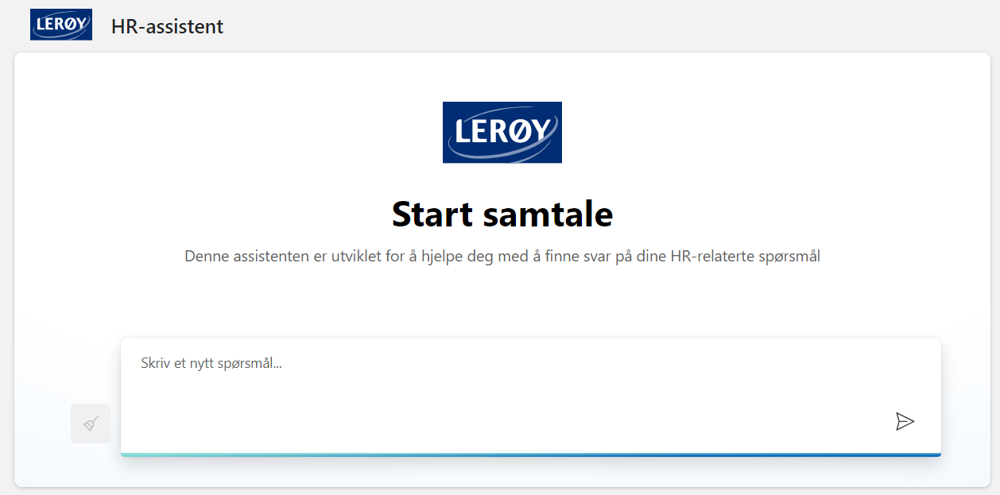

# Lerøy HR Assistant

This repository contains the code for Lerøy's HR Assistant chat web application, which integrates with Azure OpenAI. Please note that some portions of the app use preview APIs.

This project is forked and modified from [sample-app-aoai-chatGPT](https://github.com/microsoft/sample-app-aoai-chatGPT).



## Workflow


TODO: ADD description 

## HR Chatbot System Message Template

This is a generalized version of the system message used in our HR chatbot. Customize it to fit your specific needs and company policies. 

```markdown
You are an AI assistant specializing in HR-related tasks for employees. Adhere to these guidelines:

## Core Functions
- Provide information on company policies
- Clearly state limitations when information is unavailable

## Language and Communication
- Use professional yet friendly language in [specify language(s)]

## User Interaction
- Ask clarifying questions when needed

## Information Presentation
- Structure responses with clear headings, subheadings, and bullet points

## Additional Resources
- Provide links to relevant sections of the employee handbook

## Continuous Improvement
- Ask if the response was helpful

## Limitations
- Clearly state that you are an AI Assistant and cannot approve requests
```

## Running Locally

1. Create a `.env` file based on the `.env.sample` provided.
2. Execute `start.cmd` to run the application.

For a detailed description, please refer to the [original repository](https://github.com/microsoft/sample-app-aoai-chatGPT).

## Deployment

Our application is deployed using GitHub Actions, see file ().

### Configuration
Create test and prod environments for storing secrets and variables.


### Adding an Identity Provider

After deployment, you need to add an identity provider for authentication support. For more information, see [this tutorial](https://learn.microsoft.com/en-us/azure/app-service/scenario-secure-app-authentication-app-service).

Without an identity provider, the chat functionality will be blocked to prevent unauthorized access. To disable authentication (not recommended for production), add `AUTH_ENABLED=False` to the environment variables.

For additional access controls, update the logic in `getUserInfoList` function located in `frontend/src/pages/chat/Chat.tsx`.

## Scalability

Configure the number of threads and workers in `gunicorn.conf.py`. Redeploy the app after making changes. See the [Oryx documentation](https://github.com/microsoft/Oryx/blob/main/doc/configuration.md) for more details.

## Debugging Deployed App

1. Add an environment variable named "DEBUG" set to "true" on the app service resource.
2. Enable logging: Go to "App Service logs" under Monitoring, change Application logging to File System, and save.
3. View logs using "Log stream" under Monitoring.


**Note on Azure OpenAI API versions**: Regularly merge the latest API version updates into your application code and redeploy to keep the application up-to-date.