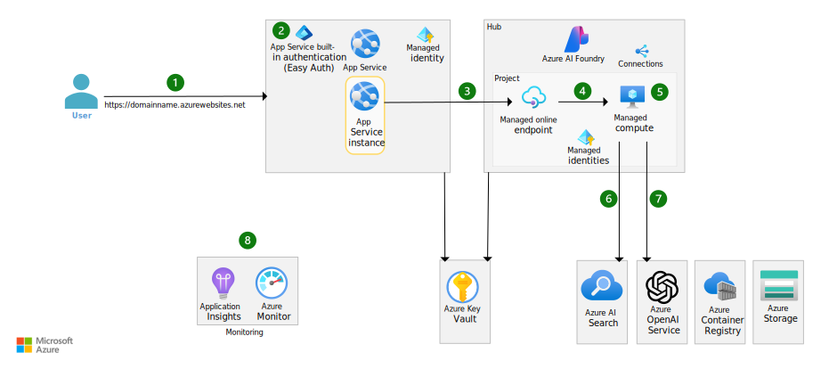
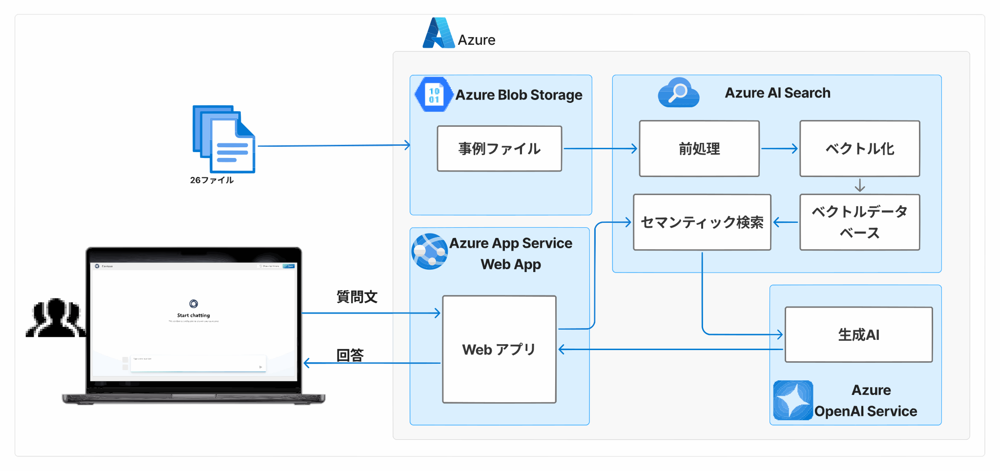

# NeuronESの導入事例を答えてくれるチャットボットの実験記録
NeuronESの事例について回答してくれるAIアシスタントを`sample-app-aoai-chatGPT`を使って構築しました。 
ナレッジとして26件のNeuronESの詳細事例のファイル（.pdf, .pptx）を利用しています。 
これを使って「チャットボットでファイル検索ができるか？」を実験し、NeuronESでの検索と比較しました。 

[アーキテクチャダイヤグラム](https://learn.microsoft.com/ja-jp/azure/architecture/ai-ml/architecture/basic-openai-e2e-chat) 

この実験の結果を参考にしていただきたい方
- 生成AIを使ったチャットボットのサービスをご利用の方
- AzureやAWSで生成AIを使ったチャットボットを構築された方
- Box AIやDropbox Dashの利用を検討している方
- Microsoft 365 Copilotを評価している方

## 構築したチャットボットの動作確認
構築したチャットボットに質問した時の回答結果とNeuronESの場合の検索結果の比較を示します。 
（NeuronESの場合は、プロンプトの中のキーワードで検索した場合を想定します）

|No.|プロンプト|目的|結果|NeuronESの場合|
|--:|:---|:--|:--------|:-------|
|1|Neuronの導入事例を探してください|回答する事例の数を確認|5社~7社の事例を回答|26社の事例を表示|
|2|SharePoint Onlineの検索の事例を探してください|2社の事例を回答するか確認|2社の事例を回答|2社の事例を表示|
|3|SPOを検索対象にした導入事例を探してください|「SPO」を「SharePoint Online」として回答できるか確認（あいまい検索）|2社の事例を回答|Sharepointをヒットする。類義語検索も可能。|
|4|Neuronの導入事例を10社分探してください|10社分の事例を回答するか確認|7社を回答|結果に表示する事例の数は指定できないが10社以上の事例を表示|
|5|ニューロンの導入事例を探してください|カタカナになる表記揺れに対する挙動を確認|
|6|Neruonの導入事例を探してください|typoに対する挙動を確認|
|7|Neuronが競合と比べて選ばれる理由を3つ教えてください|必要な情報をまとめられる|３つを回答|方法1)検索して回答を自分で作る 方法2)生成AIオプションを使う|
|8|
|9|
|10|

## 構築したチャットボットのパラメーター設定
構築したチャットボットの構成は下記になっています。 
事例の26ファイル（pdfとpptx）をAzure Blob storageにアップロードしています。 

 
構築したチャットボットのパラメーターは以下です。 
### Search Serviceのスキルセット
#### 前処理(チャンク設定)
<!--
"@odata.type": "#Microsoft.Skills.Text.SplitSkill",
"description": "Split skill to chunk documents",
"defaultLanguageCode": "ja",
"textSplitMode": "pages",
"maximumPageLength": 512,
"pageOverlapLength": 128,
-->
|パラメーター名|値|
|:-----------|:--|
|defaultLanguageCode|ja|
|textSplitMode|pages|
|maximumPageLength|512|
|pageOverlapLength|128|

#### ベクトル化
<!--
"@odata.type": "#Microsoft.Skills.Text.AzureOpenAIEmbeddingSkill",
"deploymentId": "text-embedding-3-large",
"dimensions": 3072,
-->
|パラメーター名|値|
|:-----------|:--|
|deploymentId|text-embedding-3-large|
|dimensions|3072|

### Webアプリの環境変数（一部）
#### 検索
|名前|値|
|:---|:--|
|AZURE_SEARCH_QUERY_TYPE|vector_semantic_hybrid|
|AZURE_SEARCH_STRICTNESS|3|
|AZURE_SEARCH_TOP_K|5|

セマンティックランカー：Free、1か月あたりのリクエストが1,000件を使用 

#### LLM
|名前|値|
|:---|:--|
|AZURE_OPENAI_MAX_TOKENS|2000|
|AZURE_OPENAI_MODEL|gpt-4o|
|AZURE_OPENAI_EMBEDDING_NAME|text-embedding-3-large|
|AZURE_OPENAI_SYSTEM_MESSAGE|Neuron ESの導入事例の情報を見つけるのに役立つ AI アシスタントです。回答には出典元ファイルのurlをつけてください。|
|AZURE_OPENAI_TEMPERATURE|0|
|AZURE_OPENAI_TOP_P|0|
 

## パラメーターの設定変更による回答内容の変化の実験
- 基本的にはAzure上でAzure OpenAI ServiceとAzure AI Searchを利用して構築したチャットボットを使います。
- 実験内容によってはDifyで作ったチャットボットを利用します。LLMやEmbeddingはAzure OpenAI Serviceを利用し、Rerankモデルはcohereの`rerank-v3.5`を利用します。ナレッジは同じ事例ファイルを使います。

|項目|パラメーター|実験値|プロンプト No.|実験結果|考察|
|:--|:--------|:----|:--------------------|:------|:--|
|チャンキングの影響|前処理(チャンク設定)|||||
|Embeddingモデルの影響|ベクトル化|||||
|[セマンティック検索のtop-kの影響](./research-semantic-search.md)|検索||4|||
|[LLMのモデルの違いによる影響](./research_LLM_model.md)|LLM|gpt-4o gpt-4o-mini gpt-4 gpt-35-turbo|2|gpt-4oが詳細に回答する|回答内容かコスト重視か検討|
|LLMのパラメーターの影響|LLM|||||

## 料金に関する考察
[チャットボットの料金の分析](./research_price.md)
